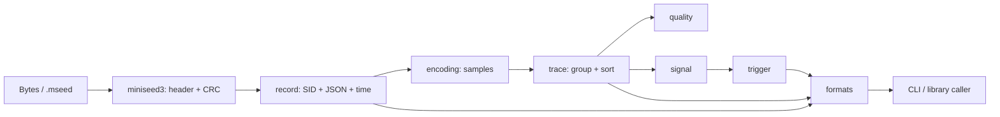

# MoonSeis 架构

## 目标

MoonSeis 将 miniSEED 3 的二进制解析与后续波形分析拆成小型 MoonBit 包。
解析层不 panic：可预期的数据错误使用 `ParseError` 返回；只有声明长度足以定位
下一条记录时，流迭代器才会在错误后继续。

## 数据流



## 包职责

- **binary**：little-endian 基础读取、写入、拼接和切片。
- **time**：Unix epoch 纳秒时间、header 构造、UTC ISO-8601 格式化；负 epoch
  使用 floor division 规范化。
- **sid**：解析和验证 FDSN Source Identifier。
- **miniseed3**：解析 40 字节固定头并实现 Castagnoli CRC-32C。
- **encoding**：把固定宽度数值 payload 解码为 `Array[Double]`；文本和 opaque
  payload 保留为原始字节；Steim 返回 `UnsupportedEncoding`。
- **record**：装配 header、SID、extra headers、时间、样本和原始 bytes，并迭代
  拼接记录流。
- **trace**：按 SID 分组、按时间排序，同时保留原始 record segments，避免拼接样本
  后丢失 gap/overlap 元数据。
- **quality**：计算指标、运行独立规则并聚合为 0–100 分。
- **signal**：无状态波形变换和统计函数。
- **trigger**：Classic / Recursive STA/LTA 及事件区间提取。
- **formats**：纯字符串输出，不负责文件系统。
- **cmd/main**：参数分发和 native 文件读取，是唯一带 C stub 的包。

## 关键约定

### miniSEED 3 记录

固定头为 40 字节且使用 little-endian。总长度为：

```text
40 + identifier_length + extra_headers_length + payload_length
```

CRC 字段位于记录绝对偏移 28..31。计算 CRC-32C 时这 4 字节视为零。
extra headers 非空时必须是合法 UTF-8 JSON，SID 必须通过 `sid.parse`。

### 时间与 trace

`Record::end_time` 是 exclusive end：

```text
start + sample_count / effective_sample_rate
```

它表示下一条连续记录的期望开始时间。`Trace` 的样本按记录时间顺序拼接，
同时保存 `records`，分段诊断直接使用这些原始时间边界。

### 错误恢复

- magic、版本或 header 长度错误无法可靠找到下一条记录，因此停止流迭代。
- CRC、SID、UTF-8、JSON、时间或 payload 解码错误在总长度可信时只影响当前记录。
- Steim 编码不会 panic，而是返回 `UnsupportedEncoding`。

## CLI I/O

MoonBit CLI 只依赖 `moonbitlang/core/env`。文件读取由 `cmd/main/fileio.c`
提供：Windows 使用 `_wfopen`；类 Unix 当前将 ASCII UTF-16 code unit 转成窄字符。
这一层与库解析 API 隔离，Wasm 或其他宿主可直接把 `Bytes` 传给根 facade。

## 测试

每个公开子系统有独立测试；`internal/fixtures` 生成带正确 CRC 的记录流，
`fixtures/example.mseed` 用于 CLI 端到端 smoke test。提交前运行：

```powershell
moon check --warn-list +73
moon test
moon info
moon fmt
moon check
moon test
```
